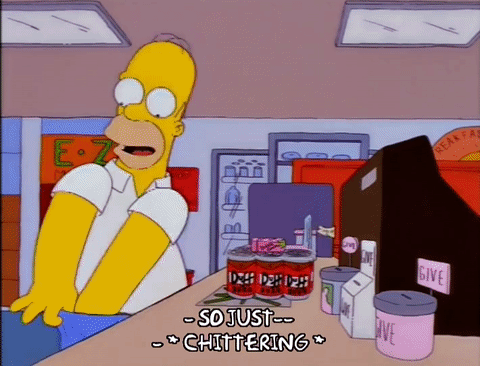

# Proyecto caja registradora 💶

En este proyecto simularemos el funcionamiento de una caja registradora. En él seleccionaremos un producto (🍺) y le diremos al programa con qué cantidades de dinero vamos a pagar. El programa debe devolver un importe desglosado del cambio que se le va a devolver al usuario. Además, se establecen varias situaciones en casos de que no pueda devolverse cambio o si el pago del usuario ha sido insuficiente.

## Tecnologías utilizadas

- **HTML**
- **CSS**
- **JavaScript**
- **LocalStorage**

## Estructura del proyecto

- 📁 Media
- 📁 Script
- 📁 Styles
- <> index.html
- 📖 README.md

## Funcionalidades

- Mostrar catálogo de cervezas con nombre, imagen y precio.
- Solicitar pago al usuario mediante prompts (billetes y monedas).
- Calcular si el pago es suficiente y devolver cambio óptimo (con billetes/monedas de mayor valor primero).
- Mensajes dinámicos en pantalla para:
  - Pago insuficiente
  - Pago exacto
  - Cambio devuelto
  - Imposibilidad de devolver cambio exacto
- Persistencia del contenido de la caja en `localStorage`.

## Cómo usarlo

1. Clona este repositorio o descarga el código
2. Puedes acceder a la caja registradora a través de este enlace: https://mario-olopez.github.io/caja-registradora/
3. Selecciona una cerveza.
4. Introduce cuántos billetes o monedas usará el cliente.
5. Recibe el cambio o el mensaje correspondiente.

---